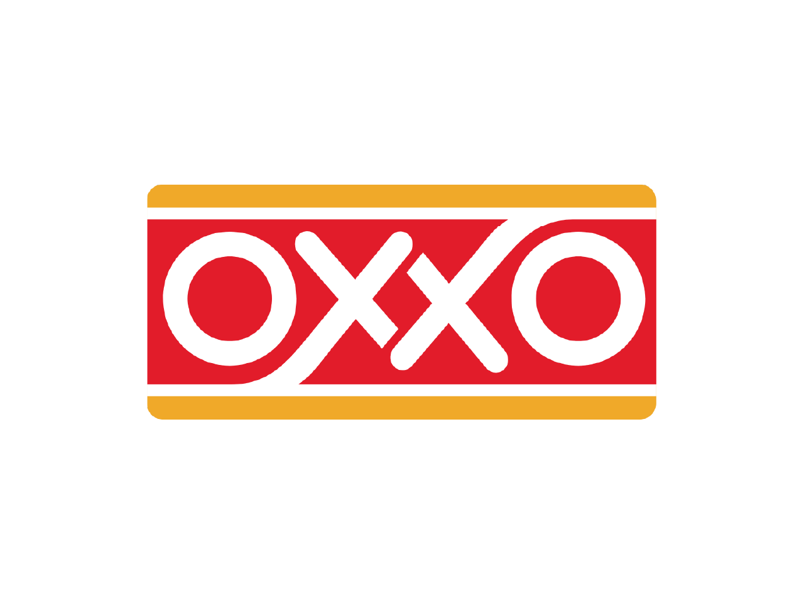

# Tiendita OXXO - Sistema de Gestión 🏪

> Sistema de gestión para tiendas OXXO que permite administrar productos, categorías, clientes y compras de manera eficiente.



## 📋 Tabla de contenidos

- [Características](#características)
- [Tecnologías](#tecnologías)
- [Requisitos previos](#requisitos-previos)
- [Instalación](#instalación)
- [Uso](#uso)
- [Estructura del proyecto](#estructura-del-proyecto)
- [API](#api)
- [Contribución](#contribución)
- [Licencia](#licencia)

## ✨ Características

- Gestión completa de productos (CRUD)
- Administración de categorías de productos
- Registro y administración de clientes
- Procesamiento de compras
- Interfaz responsiva y amigable
- Dashboard con estadísticas

## 🛠️ Tecnologías

- React 18.3
- Vite 5.2
- CSS puro (sin frameworks)
- RESTful API

## 📋 Requisitos previos

- Node.js ≥ 18.0.0
- NPM ≥ 8.0.0
- Servidor backend con API REST ejecutándose en http://localhost:8080

## 🚀 Instalación

1. Clona este repositorio:

```bash
git clone https://github.com/tu-usuario/tiendita-oxxo.git
cd tiendita-oxxo